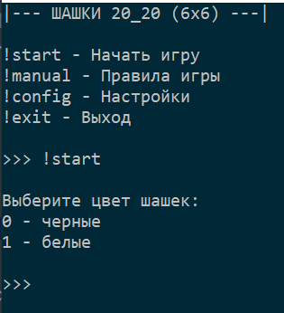
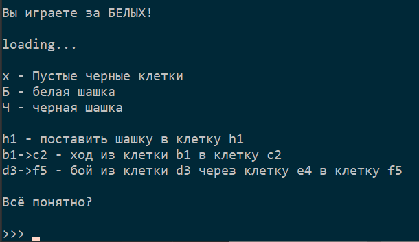
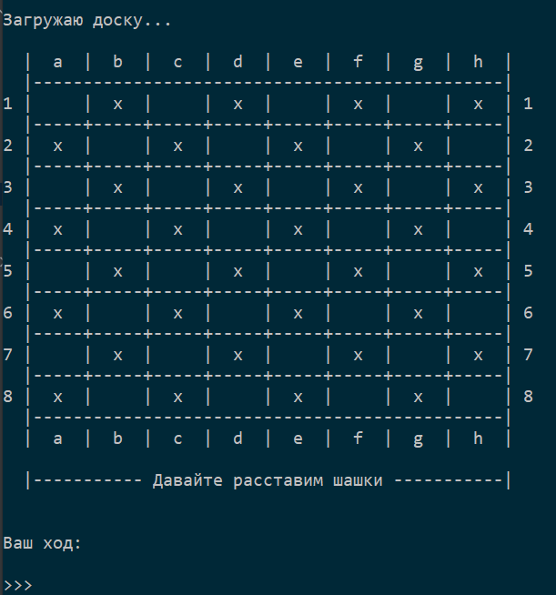
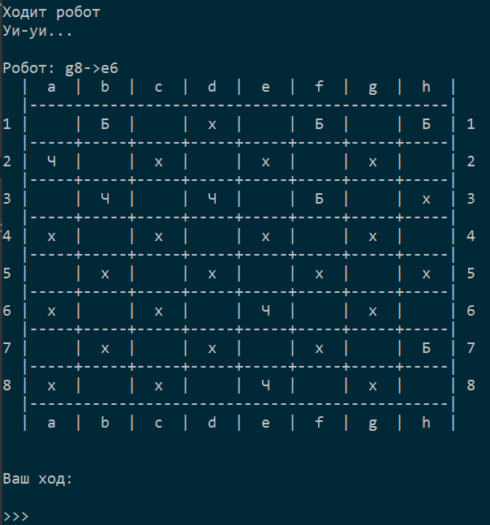
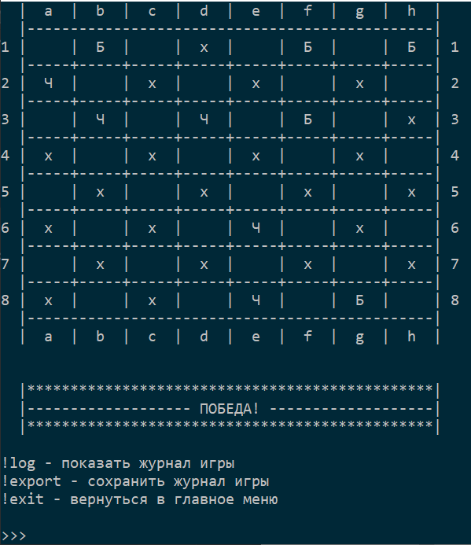
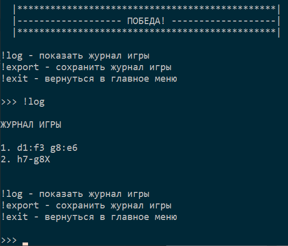

# Консольные шашки
###Укороченная версия 6 x 6 со следующими правилами:
- Пользователь выбирает шашки любого цвета, за который 
собирается играть;

- Поочередно осуществляется ввод расположение шашек на доске 
(количество шашек ограничено 6 для каждого цвета);

- Игра заканчивается при прохождении одной шашки любого 
цвета в дамки или победой пользователя или победой ПК.

